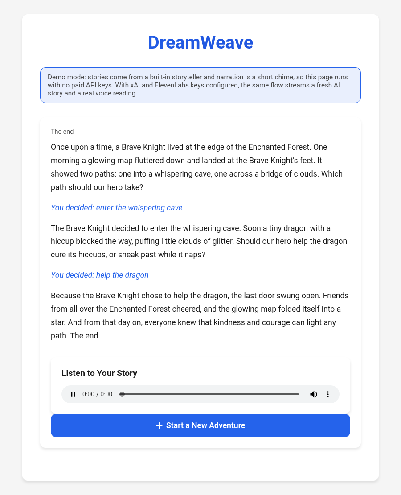
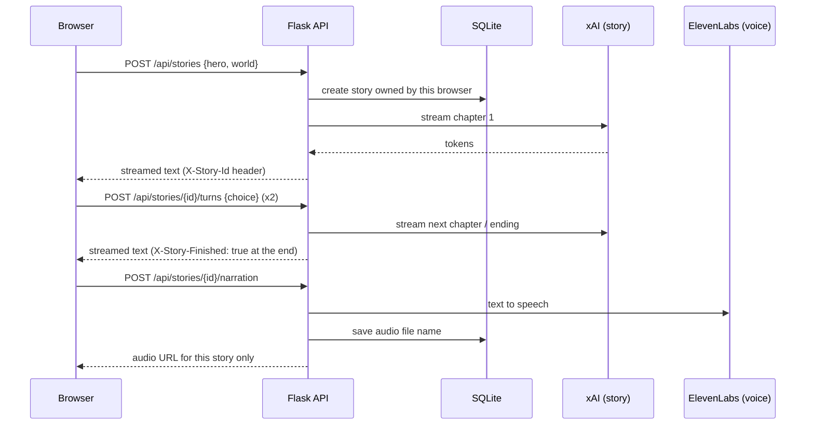

# DreamWeave

Interactive bedtime stories for kids. Pick a hero and a world, steer the adventure twice, and DreamWeave writes each chapter live (streamed word by word) and then reads the finished story aloud.

This was my capstone project for Boot.dev. The first version worked for one person at a time; this version is rebuilt so it holds up with many people using it at once.



## How it works



- **Story state lives on the server** (SQLite). The browser cookie only holds a random owner token, so stories are not limited by the 4 KB cookie size and one person cannot read another person's story (unknown or foreign IDs return 404).
- **Every story gets its own narration file.** The original wrote everyone's audio to one shared `static/output_audio.mp3`, so two people finishing at the same time heard each other's stories.
- **Streaming with clean failures.** The server pulls the first token before it starts the response, so an upstream outage becomes a friendly 502 instead of a half-written page. If the stream breaks midway, nothing partial is saved and the reader can retry that step.
- **Demo mode with no keys.** Without API keys, a built-in storyteller and a chime narrator stand in, so the whole flow runs (and is tested) for free. With `X_AI_API_KEY` and `ELEVENLABS_API_KEY` set, it uses the real services.
- **Kid-safe prompting.** Reader input is passed as labeled data, not instructions, and the system prompt keeps stories age-appropriate.
- **Model output is rendered as text, never HTML**, closing the injection path the old `.html(story)` call had.

## What changed from the capstone version

| | Before | Now |
|---|---|---|
| Concurrency | One shared audio file for all users | Per-story audio, served only to its owner |
| State | Whole story in the session cookie | SQLite, cookie holds an owner token |
| Model | Hardcoded `grok-beta` preview model | Configurable, default `grok-3-mini`, streamed |
| Errors | Any API hiccup was a 500 with a stack trace in logs | 502 with a friendly message, partial chapters never saved |
| Input | Unchecked | Length limits, control characters stripped, 16 KB request cap, 20 stories per hour per browser |
| Frontend | jQuery, model output injected as HTML, page replaced via `document.write` | Fetch streaming, text-only rendering, one page, progress indicator |
| Sessions across workers | n/a | Stable secret shared by all gunicorn workers (found by an end-to-end run where a random per-worker key logged users out) |
| Tests | None | 24 pytest tests, 91% line coverage, run in CI |

## Run it

```bash
python -m venv .venv && . .venv/bin/activate
pip install -r requirements-dev.txt
cp .env.example .env      # leave the API keys empty for demo mode
flask --app main run      # or: gunicorn main:app -c gunicorn.conf.py
```

## Test

```bash
pytest --cov=dreamweave
ruff check .
```

Tests cover the full story flow, two users never seeing each other's story or audio, eight stories started concurrently, validation, rate limiting, upstream failures before and during streaming, narration failure keeping the story, and parsing of xAI's streaming format.

## API

| Method | Path | Body | Notes |
|---|---|---|---|
| POST | `/api/stories` | `{hero, world}` | streams chapter 1; `X-Story-Id` header |
| POST | `/api/stories/{id}/turns` | `{choice}` | streams the next chapter; `X-Story-Finished: true` on the ending |
| GET | `/api/stories/{id}` | | story JSON (owner only) |
| POST | `/api/stories/{id}/narration` | | creates narration once, returns `audio_url` |
| GET | `/api/stories/{id}/audio` | | the audio file (owner only) |
| GET | `/healthz` | | which providers are active |

## Deploy

`render.yaml` describes a free Render web service with a health check and a generated `FLASK_SECRET_KEY`. Leave the API keys unset for demo mode or add them for real stories and narration.

## Stack

Python, Flask, SQLite, gunicorn, xAI chat completions (streaming), ElevenLabs text to speech, vanilla JavaScript.
